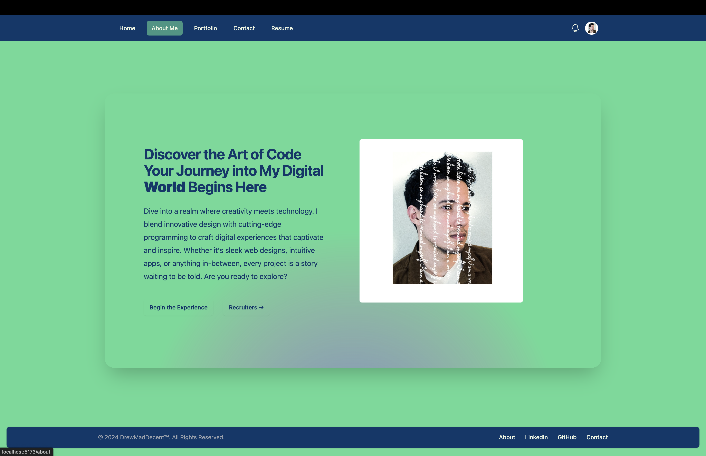

# Andrew Tullos's Portfolio

## Overview

Welcome to Andrew Tullos's Portfolio, a comprehensive showcase of my journey and achievements in the realm of software development. This portfolio is not just a collection of projects but a reflection of my passion for blending creativity with technology.

## Objective

The main goal of this portfolio is to present a curated selection of my work, highlighting my skills, creativity, and experience in various aspects of software development. It serves as a platform to demonstrate my proficiency in web development, database management, and other key areas of technology as well as display my React knowledge.

[Live Site Deployment](https://main--scintillating-quokka-8e91dc.netlify.app/)

## Table of Contents

- [Projects](#projects)
- [Technologies](#technologies)
- [Experience](#experience)
- [Education](#education)
- [Contact](#contact)

## Projects

This section showcases a variety of projects I have worked on, demonstrating my versatility and expertise in software development. Each project is detailed with its objectives, technologies used, and my role in its development.

## Technologies

A comprehensive list of technologies and tools I am proficient in. This includes programming languages, frameworks, databases, and other software development tools.

## Experience

An overview of my professional experience, including roles I have held, responsibilities, and key achievements in each position.

## Education

Information about my educational background, highlighting degrees, certifications, and specialized training relevant to software development and technology.

## Contact

Details on how to get in touch with me, including social media links, email, and a contact form for direct inquiries.

## Contributing

While this is a personal portfolio, I appreciate any feedback or suggestions for improvement. Feel free to reach out through the contact information provided.

## License

This portfolio is open for public viewing and serves as a personal brand showcase. Any use of the content for purposes other than individual viewing should be done in accordance with copyright laws.
